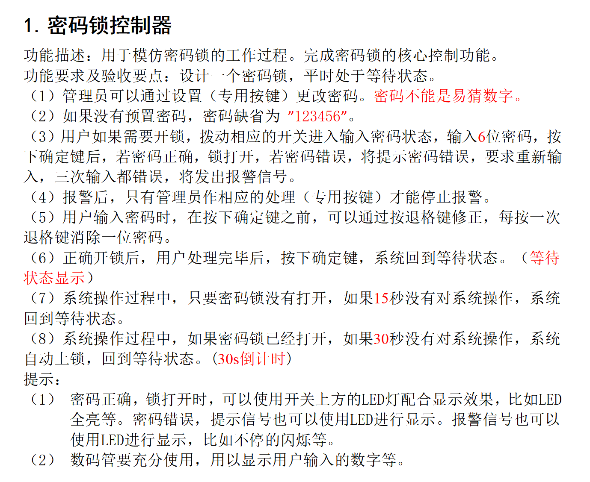

# SEU_passwordlock
## 东南大学信息大三暑期FPGA项目六位密码锁

这是东南大学暑期信息工程大三暑校的FPGA密码锁Verilog代码，在vivado平台实现。包含一个顶层文件[password_lock.v](password_lock.v)，一个模块化文件[digital.v](digital.v)和一个约束文件[nexys4ddr_password_lock_fixed.xdc](nexys4ddr_password_lock_fixed.xdc)。
本项目是在另一位学长的开源代码的基础上改进的 **[(这里是学长的源代码)](https://github.com/handesen123/-fpga-)**，学长的代码是四位密码锁并且功能与我的有些不同，所以我在其基础上改进了一些功能，比如加了倒计时显示、加了简单密码报警状态等，在代码注释中有所体现。请读者自行阅读代码及其注释。

## 题目如下

## 各文件功能简述

在模块文件中，设计了密码输入和数码管扫描、倒计时显示功能；

在顶层文件中，分别实例化了用户状态和管理员状态，共用该模块文件，并且在顶层文件中设计了五个状态，分别为等待输入密码状态、开锁状态、管理员设置密码状态、密码错误报警状态和密码过于简单警告状态。

约束文件即为各个接口信息。

## 开发板型号

本项目使用的开发板型号为Nexys4 DDR，在[Nexys 4 DDR FPGA Board Reference Manual.pdf](Nexys_4_DDR_FPGA_Board_Reference_Manual.pdf)中有详细接口信息，请自行查阅对照。

## 总结

本项目实现了基于Verilog的FPGA六位密码锁设计，很好地完成了题目要求，但在分模块和状态机（本项目主要涉及一步状态机）设计上尚有欠缺，后续会继续完善。
